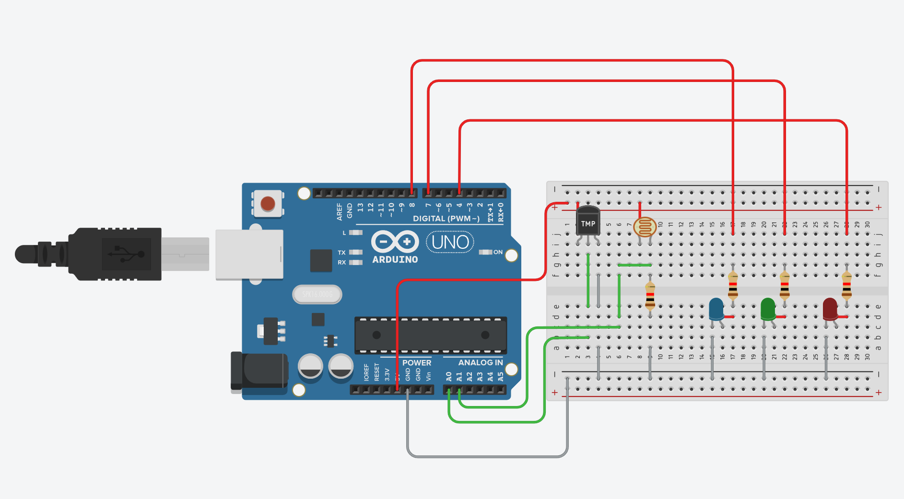

# Temperature and light meter
### All code here is used for Arduino environment only

The code in both the `.c` and `.ino` files are the, just different file formats.

## Task:
Create a system based on Arduino Uno or Arduino Yun, which measures the light intensity and temperature at the same time. The systems should monitor the dependency between these two measurements and warn about the deviations.  

Normal dependencies, all other variables are treated as deviating values: 
| Temperature | Light Intensity |
| ----------- | ----------------|
| < -12 °C    |        0%       |
|-12 °C - 0 °C|     1% - 20%    |
| 0 °C - 20 °C|    21% - 60%    |
|   >= 21 °C  |   61% - 100%    |

The system should use periodically read the temperature and light intensity (periodicity, in seconds, should be 
provided as a variable in the program).  
The system should use three LEDs to indicate the normal dependency (GREEN), deviation when the temperature 
is higher than it should be, given the Light intensity (RED), and the deviation when the temperature is lower than 
it should be (YELLOW or BLUE).  

NOTE: `exerc_3_2` can not run nor compile outside an arduino uno environment.

