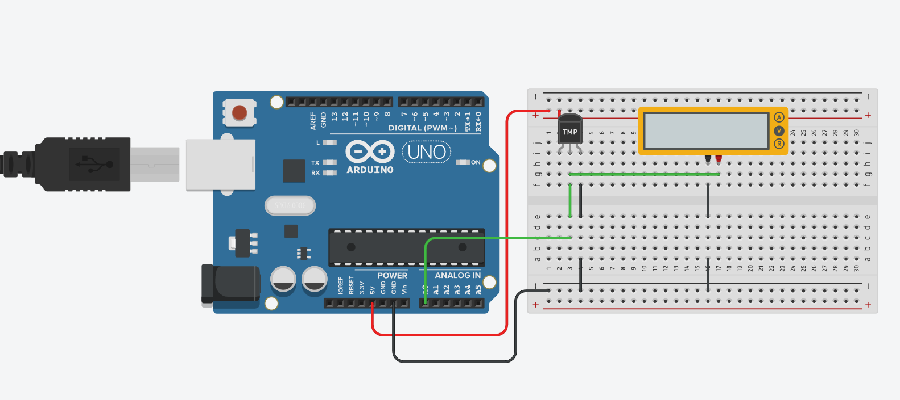

# Temperature meter v2
### All code here is used for Arduino environment only

The code in both the `.c` and `.ino` files are the same, just different file formats.

## Task:
In  this  exercise  you  should  add  the  display  of  the  temperature  to  your  temperature  meter  and  use  analog conversion of the temperature meter.   
 
The main idea is that the main-loop in the program, with short delay (500ms), checks the temperature by reading the input voltage on AD – input A0 - calculates the corresponding temperature and print it on the serial monitor.

D  converter  with  10  bits  resolution.  You  can  use  the  Arduino  IDE:s 
function  (analogRead())  to  read  A0.

You should add Multimeter to be able to check the printed temperature 
for a certain in-voltage. 
 
The main program should periodically check the temperature, write it 
to the multimeter and to the serial port (something like TinkerCad’s serial 
monitor).  

**IMPORTANT! You are not allowed to use <DHT.h> library for this task.**

NOTE: `exerc_3_3` can not run nor compile outside an arduino uno environment.

# Board

