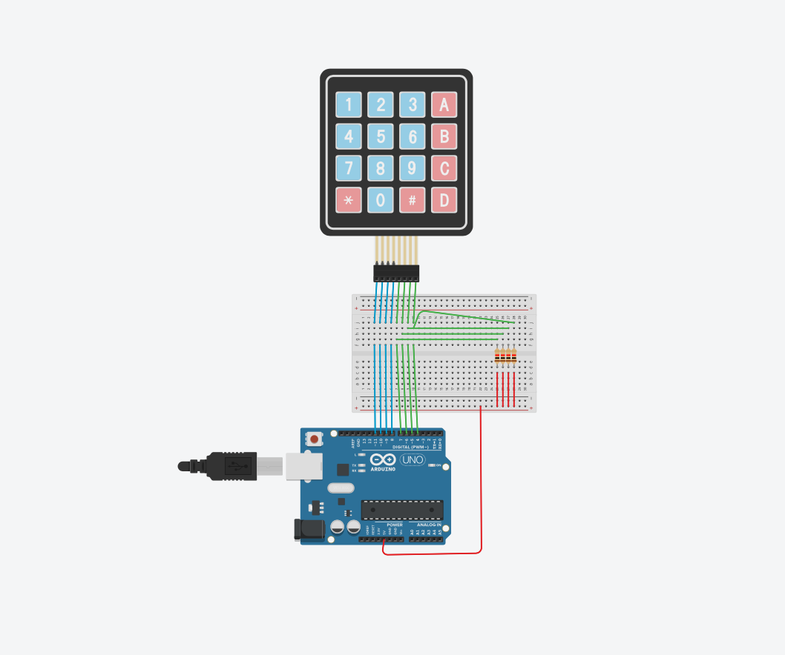

# Keypad Scanning with Library
### All code here is used for Arduino environment only

The code in both the `.c` and `.ino` files are the, just different file formats.

## Task:
### Use keypad.h library to make the same system as in Exercise 3_4.

In  Tinkercad  you  should  design  a  new  circuit  as  described 
above and shown in the figure to right. We will later expand 
the circuit so it ́s good to design it as the figure shows. 
 
You should then, also in Tinkercad, develop a program 
reading  the  keyboard  system  above.  The  program  should 
print  out  the  key  number  in  the  serial  monitor  if  a  key  is 
pressed. If no key is pressed there should be nothing printed 
out.  
 
The program structure should be as below. You should also 
use the predefined macros as in earlier exercises.  
 
You can use the function Serial.println() for printing 
on the monitor. 
------------------------------------------------------------------------ 
- configure the IO ports 
- in an infinity loop : 
     Call a function checking if any key is pressed and if it 
     should return it ́s value. 
     If a key was pressed print out the key value ( 0-9 , 
     A-F) on the serial monitor. 
     Delay for one second. 

NOTE: `exerc_3_4v2` can not run nor compile outside an arduino uno environment.

