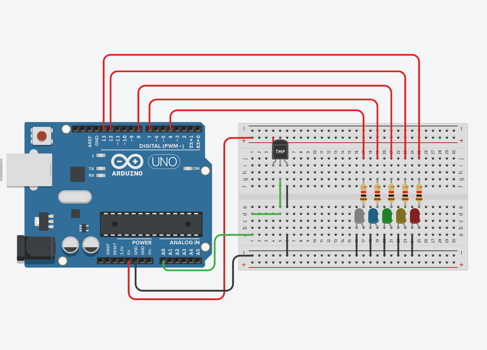

# INTERRUPTS ON TIMER
### All code here is used for Arduino environment only

The code in both the `.c` and `.ino` files are the same, just different file formats.

## Task:
Create a system based on Arduino Uno or Arduino Yun, which measures the temperature and lids the LEDs. You should  use  5  LEDs  for  the  temperature  measurement.  The  LEDs  should  be  turned  on  depending  on  the temperature.

e.g.
- < 0 degrees Celsius, all LEDs are turned off,
- 0-10 degrees Celsius, 1 LED is turned on, 
- 11-20, 2 LEDs are turned on,
- 21-30, 3 LEDs are turned on, 
- 31-40, 4 LEDs are turned on,
- 41+, all 5 LEDs are turned on.

You  should  define  for  which  temperature  range  the  LEDs  should  be  turned  on,  these  should  be  provided  as variables.  

You should check for the temperature periodically, using interrupts. The period should be defined in the code.

NOTE: `exerc_4_1` can not run nor compile outside an arduino uno environment.

