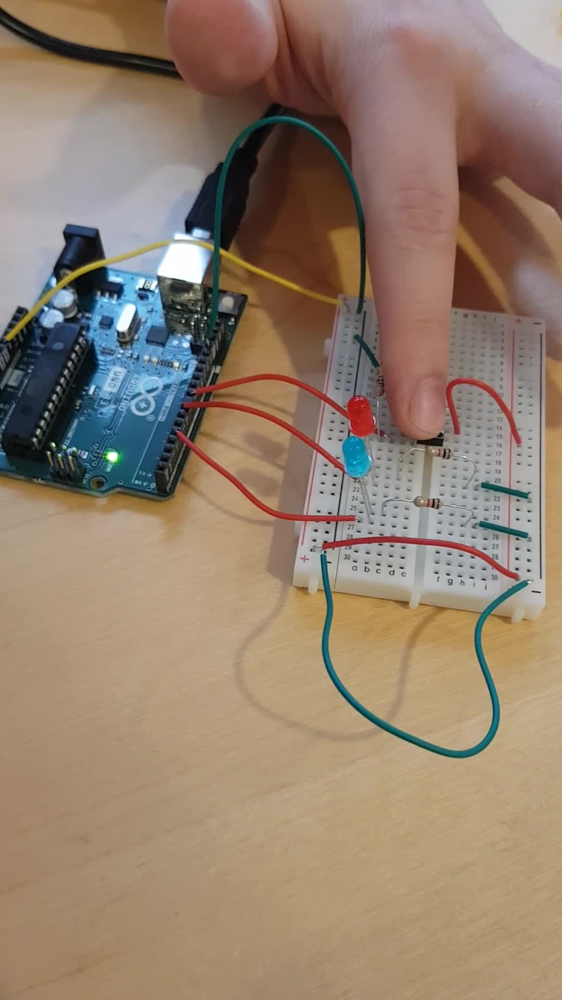

## TASK 1: SET-UP 
Create a simple system in Arduino Uno, which will use

- one LED (blink periodically, e.g. once a second),
- another LED and,
- a button. 

The second LED should be on when the button is pressed, and off, when the button is not pressed. 

## Board: 

## Demo

Click the picture to play video. 
If video is broken, use this link: <a>https://streamable.com/1k9af5</a>