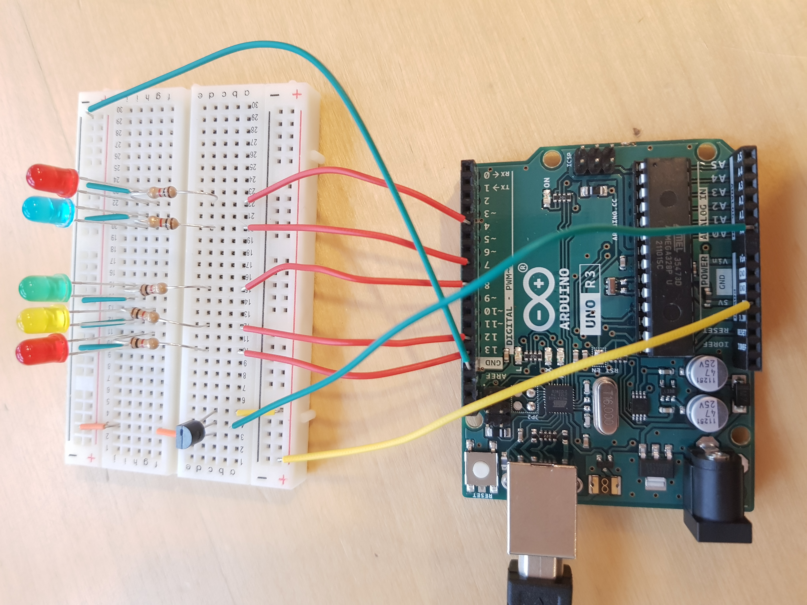

## TASK 2: TEMPERATURE METER 
Create a system based on Arduino Uno or Arduino Yun, which measures the temperature and lids the LEDs. 
You should  use  5  LEDs  for  the  temperature  measurement.  The  LEDs  should  be  turned  on  depending on the temperature – e.g. 
- for 0-10 degrees Celsius, 1 LED is turned on,
- for 11-15, 2 LEDs are turned on, 
- for 16-20, 3 LEDs are turned on,
- for 21-25, 4 LEDs are turned on,
- for > 25, all 5 LEDs are turned on.

You should __define__ for which temperature range the LEDs should be turned on, these should be  provided as variables(``#define``).

You should check for the temperature periodically, using interrupts or delay(). The period should also be defined in the code.  

Your task is to: 
- Create a board  
    - with the right number of LEDs  
    - with the right wiring to prevent damage to components 
    - use different colors for the LEDs for the different temperature intervals 
- Write the code 
    - Using the definitions (#define) whenever needed.  

## Board:
