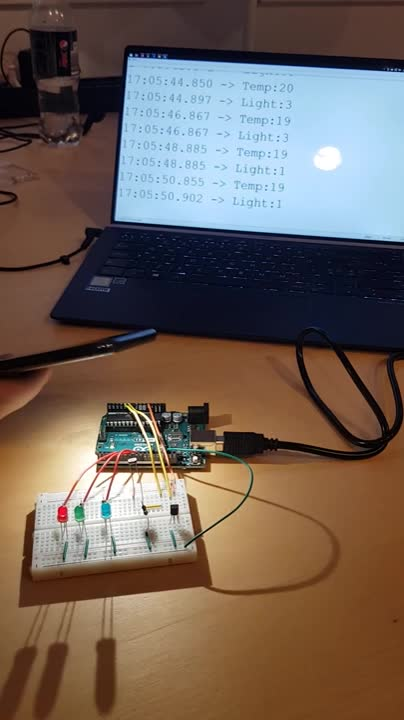

## TASK 3: TEMPERATURE AND LIGHT METER 
Create a system based on Arduino Uno or Arduino Yun, which measures the light intensity and temperature at the same time. 

The systems should monitor the dependency between these two measurements and warn about 
the deviations.  

These are **Normal dependencies**,   all other variables are treated as deviating values:  
| Temperature | Light Intensity |
| ----------- | ----------------|
| < -12 °C    |        0%       |
|-12 °C - 0 °C|     1% - 20%    |
| 0 °C - 20 °C|    21% - 60%    |
|   >= 21 °C  |   61% - 100%    |
 
The system should periodically read the temperature and light intensity (periodicity, in seconds, should be provided as a variable in the program).

The system should use three LEDs to indicate the normal dependency (GREEN), 
deviation when the temperature is higher than it should be, given the Light intensity (RED), 
and the deviation when the temperature is lower than it should be (YELLOW or BLUE).  

You can, but do not have to, use DHT.h library for this exercise.

## Video

Click the picture to play video. 
If video is broken, use this link: <a>https://streamable.com/pac7xe</a>

