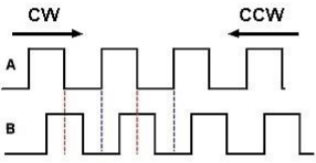
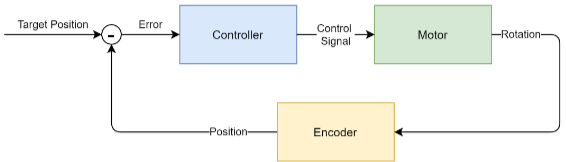
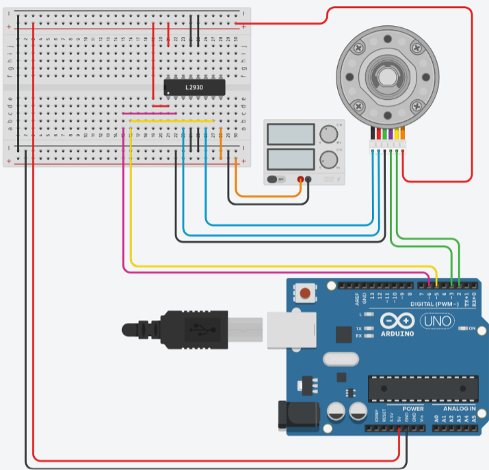

# Exercise 6.1
This exercise contains 4 sub tasks. Each of the four sub tasks are required to be implemented for the system to work as intended.

- [Task 1](https://github.com/Caisesiume/Embedded-Real-time-system-WPs/tree/main/wp6/Exerc_6_1#task-1-DC-Motor-Controller)
- [Task 2](https://github.com/Caisesiume/Embedded-Real-time-system-WPs/tree/main/wp6/Exerc_6_1#task-2-Drive-the-Motor)
- [Task 3](https://github.com/Caisesiume/Embedded-Real-time-system-WPs/tree/main/wp6/Exerc_6_1#task-3-Read-the-Encoder)
- [Task 4](https://github.com/Caisesiume/Embedded-Real-time-system-WPs/tree/main/wp6/Exerc_6_1#task-3-A-position-Controller)
- [Board](https://github.com/Caisesiume/Embedded-Real-time-system-WPs/tree/main/wp6/Exerc_6_1#Board)

## TASK 1: DC Motor Controller
Your first task is to develop a position controller for a DC motor. A DC motor converts direct current into rotational energy through a rotating magnetic field. Many DC motors 
are equipped with Encoders which track the position of the magnetic field, and thus the rotation. 

>**FIGURE 1:** Encoder signal when motor is 
rotating cw: clockwise rotation ccw: 
counter-clockwise rotation.

An Encoder provides two signals: A and B. As you can see in Figure 1, when the motor is rotating clockwise, the 
rising flank of Signal A always precedes the rising flank  of Signal B.   The opposite happens (Signal B precedes Signal A) when the motor rotates counter clockwise. Each full rotation of the motor causes a fixed number of rising flanks for the two signals. 

Your task is to control the position of the DC motor (in degrees) using the encoder signals as input.  
To setup a prototype for developing the controller, use the following materials:  

| Component   | Description |
| ----------- | ------------|
| DC Motor with Encoder | Use  the  one  with  the  white  connector.  Do  not  use  the  one with black connector. SET THE RPM to 45 (click on the motor, and there you can adjust the RPM).|
|Power Supply| Set to 12 V and 0.6 A. |
|H-bridge Motor Driver (L293D)|   <a>https://en.wikipedia.org/wiki/H-bridge</a>  |
| Arduino | Connect the Encoder Signal  to IO Ports 2 and 3,  and Input  1 and Input 2 to IO Ports 5 and 6. See Figure below. Don’t use other ports.|
   
## TASK 2: Drive the Motor

Your second task is to write a software that allows the Arduino to control the speed and direction of the DC motor. 
The program shall receive speed and direction through a serial (keyboard) input. 

## TASK 3: Read the Encoder

Your third task is to write an interrupt routine that reads the two encoder signals (connected to IO ports 2 and 3).  Conduct a small experiment to figure out how many rising flanks of Signal A and Signal B a full rotation of the 
motor cause. Use this information to update the position of the rotor (in degrees) and the direction of rotation 
while the motor is spinning.  Output the current position in degrees of the rotor on the serial monitor. 

## TASK 4: A Position Controller

Your final task is to develop a controller routine as shown in Figure 2, that allows you to drive the motor to a 
specified position (in degrees).

>**FIGURE 2:** Controller structure for a position controller

- The program should receive a desired rotor  position in degrees through the serial terminal (e.g., 270 
degrees).  
- Then, based on your current position (assume always that when you switch the system on, the rotor is at 0 degrees) you need to calculate an error term between the current and the desired position. Output the error on the serial monitor. 
    - 𝑒 = 𝑝𝑜𝑠𝑖𝑠 −𝑝𝑜𝑠𝑑𝑒𝑠𝑖𝑟𝑒𝑑 

- Finally, use the error term to derive a control signal 𝑢 that is fed into the motor. The control signal can 
be calculated as 
    - 𝑢 =𝐾𝑝 ⋅𝑒 

- Tune 𝐾𝑝 to achieve a nice performance.  

# NOTE: Disclaimer
The detailed setup is illustrated in the following figure. Pay attention to connect everything **EXACTLY** how it is in the picture if you are using [TinkerCad](https://www.tinkercad.com/). There are a handful known bugs in the emulator with the motor and the encoder, using a circut like the one below will avoid all bugs. 

## Board:

