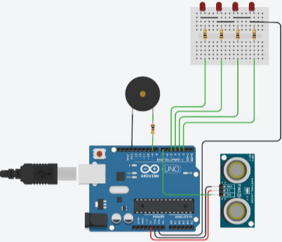
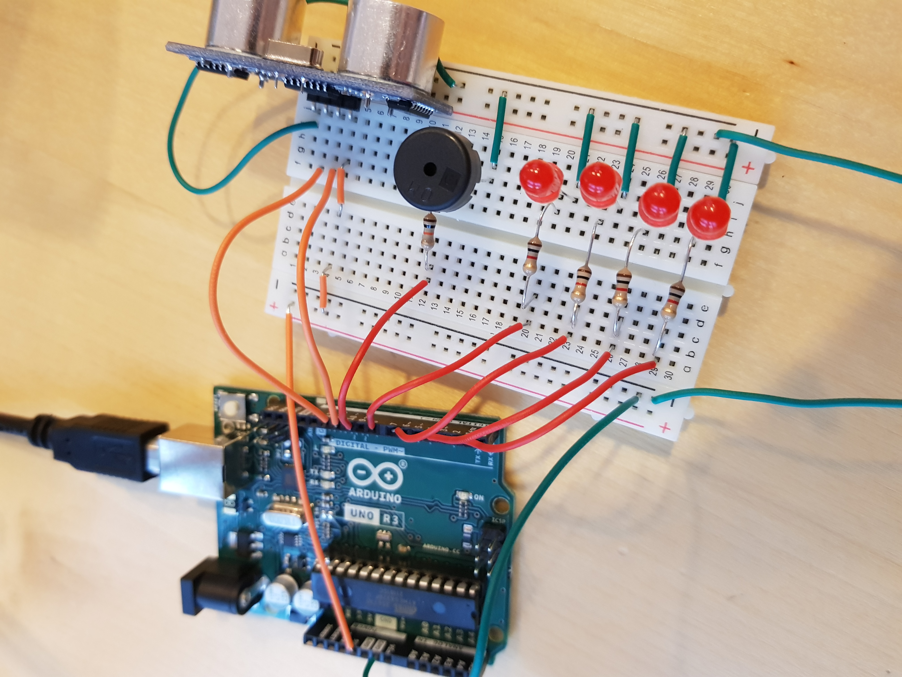
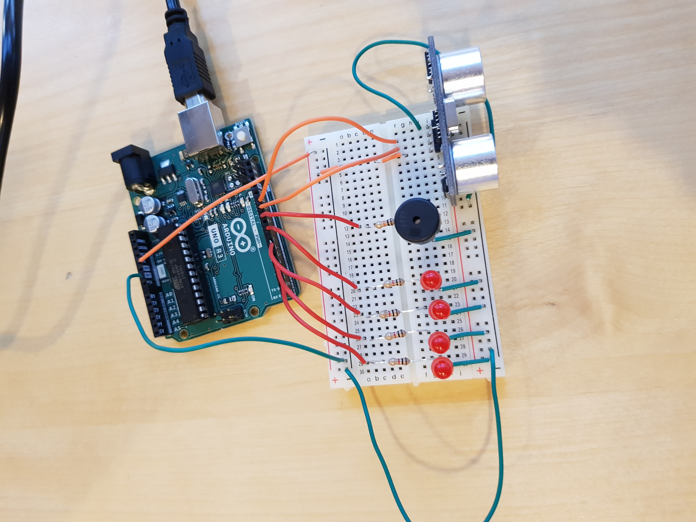

## TASK 2: Parking Assistance System
You work at a smaller company specialized in ultrasonic parking assistance systems for vehicles. A Swedish 
truck company contacts you because too many truck drivers  cause parking accidents when reversing into a parking spot. Therefore, they want you to design a new parking assistance system.

The new parking assistance system contains:
- ultrasonic system as sensor, 
- a multipurpose processing unit, 
- a head-up display with 4 red LEDs, 
- one speaker.

### Requirements:
The requirements for the system are as follows: 

1. The  system  shall  be  able  to  detect  an obstacle behind the vehicle with a maximum distance of 200 cm and a minimum distance of 25 cm. 

2. The  LEDs  shall  indicate  how  close  an 
object is to the vehicle, where all 4 LEDs 
shall  be  lighted  when  the  obstacle  is 
closer than 30 cm and the first LED shall 
light when the object is closer than 200 
cm. You can define the other limits as you want within that range.

3. A tone from the speaker shall indicate 
how close an object is. The tone shall be 
activated when the object is closer than 
200 cm. The closer the object gets to the 
vehicle, the more “annoying” the tone 
shall become. 

4. If the object is closer than 25 cm, all four LEDs shall  blink, and the tone should become distinctively 
super annoying to indicate the immediate danger. 

5. For better maintainability, each feature (i.e.,  UltraSonic distance detection, LED  lights, and Speaker 
control) shall be controlled through individual functions.

To decide if they want to hire your company for this  project, they ask you to prepare a small prototype demonstrating the concept. Your “hardware guy” already prepared a schematic of the prototype, see Figure 1.

>**FIGURE 1:** Prototype design for an ultrasonic based parking assistance system 

Furthermore, your “hardware guy” reminds you that an ultrasonic sensor works by first sending out a ping and 
then to switch to “listening” and to wait until an echo returns. She/he says something like this could work: 
- Set Pin to Output. 
- Write a zero to the output to clear the system. Wait 2 milliseconds. 
- Write a one to the output to send a ping. Wait for 10 milliseconds. 
- Write a zero to the output to stop sending the ping.  
- Set Pin to Input. 
- Listen to input if some echo returns. The time until the echo returns is related to the distance of the 
object from which the ping reflected.

Your task is to build the system according to the proposed schematic (you can choose if you want to use “real 
components” or a virtual setup on [TinkerCad](https://www.tinkercad.com/)) and to develop the necessary software. 

## Components

| Component | Description |
| ----------- | ----------------|
| Ultrasonic Distance Sensor with 3 or 4 PINs| Connect 
Power and GND to 5V and GND of the Arduino. Connect Sig to 
IO Pin 7 of the Arduino.|
| Piezo (Speaker) | Connect to IO/Pin 9 via a 100 Ohm resistance and to GND. |
| Mini Breadboard  |  |
| 4x RED LEDs | Connect the 4 LEDs, through 100 Ohm resistors, to IO Pins 2-5 of the Arduino. |
| 5x 100 Ohm resistors | See above |
| Arduino Uno | |
 
## Views of the board
 
